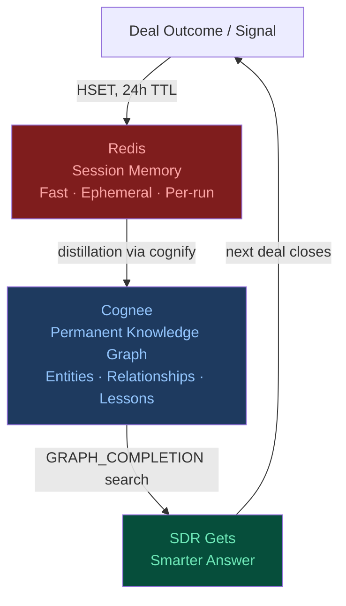
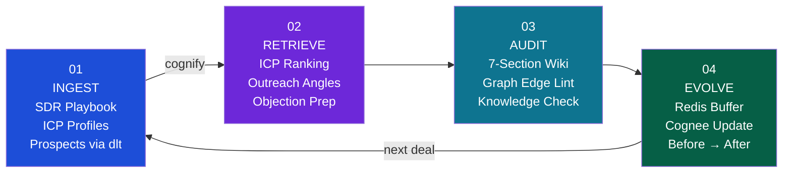
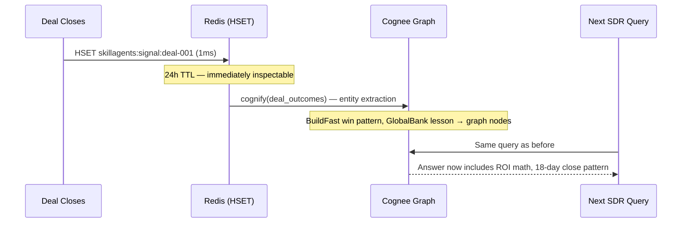
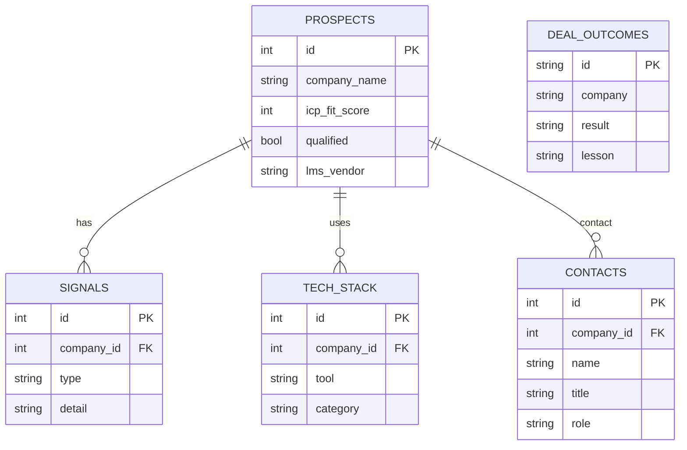

# Self-Evolving GTM Brain — SkillAgents AI

> **Cognee × Redis Knowledge Graph Hackathon 2026**
> Built on the Karpathy LLM Wiki concept: a sales knowledge base that gets smarter after every deal.

---

## The Idea

Sales teams lose institutional knowledge every time a rep leaves. Every SDR starts from zero — same objections, same mistakes, same 3-month ramp. CRMs record *what* happened. They cannot reason about *why*, and they cannot teach the next rep.

**This project builds a self-evolving GTM brain for SkillAgents AI** (an enterprise AI training platform). The brain ingests the SDR playbook, ICP profiles, and structured prospect data into a knowledge graph. After each deal — win or loss — it feeds the outcome back in. The agent's recommendations improve with every run.

The wiki never forgets. And it gets smarter after every deal.

---

## Memory Architecture

The hackathon's core two-tier pattern maps directly onto our GTM use case:



| Layer | Technology | Role | Lifetime |
|-------|-----------|------|----------|
| **Session memory** | Redis HSET | Deal signals buffered immediately on arrival | 24h TTL |
| **Permanent memory** | Cognee (Ladybug graph + LanceDB vectors) | Entities, relationships, learned win/loss patterns | Persistent |
| **Structured ingestion** | dlt `@dlt.resource` | Typed FK edges: company → signals / tech_stack / contacts | Persistent |

Redis is the hot scratchpad — signals land there in **~1ms**. Cognee's `cognify()` pipeline then extracts entities, builds graph edges, and makes those signals semantically queryable — a process that takes 30–90s. Without Redis, signals are invisible until the pipeline completes.

---

## Four-Stage Pipeline



### Stage 01 — INGEST (`01_ingest.py`)

Mixed ingestion pipeline:

- **Unstructured text** → SDR playbook (4,743 chars) + ICP profiles (4,128 chars) via `cognee.add()`
- **Structured dlt resource** → 5 prospect companies with nested arrays:

```python
@dlt.resource(name="prospects", primary_key="id")
def get_prospects():
    yield [{
        "id": 1, "company_name": "GlobalBank Corp", "icp_fit_score": 10,
        "signals":    [...],   # → Company → BuyingSignal edges
        "tech_stack": [...],   # → Company → Technology edges
        "contacts":   [...],   # → Company → Person edges
    }, ...]
```

dlt's FK mechanism (`company_id` on nested rows) becomes graph edges in Cognee. The knowledge graph emerges from structure, not just text.

**Output:** 84+ graph nodes, 228+ edges, FK edges across 4 tables.

---

### Stage 02 — RETRIEVE (`02_retrieve.py`)

Agentic multi-hop reasoning across the knowledge graph using `SearchType.GRAPH_COMPLETION`:

```python
results = await cognee.search(
    query_text="Which prospect companies best match our ICP?",
    query_type=SearchType.GRAPH_COMPLETION,
)
```

Three GTM queries:

| Query | What the graph returns |
|-------|----------------------|
| **ICP Match Ranking** | Ranked list of 5 companies with fit reasoning across signals, tech stack, and ICP criteria |
| **Outreach Angle — BuildFast SaaS** | Personalised email leveraging CTO's LinkedIn post about Cursor AI adoption gap |
| **Objection Prep — GlobalBank Corp** | Specific objection-response pairs based on their LMS vendor, compliance posture, and AI initiative |

This is **graph traversal**, not keyword search. BuildFast's CTO posted about Cursor AI → connects to AI literacy gap signal → maps to ICP B winning pattern. Pure vector search would miss this chain.

---

### Stage 03 — AUDIT / LINT (`03_lint.py`)

Seven-section knowledge wiki audit — the Karpathy LLM.txt equivalent:

```
[PRODUCT KNOWLEDGE]      What does SkillAgents AI sell and how does it work?
[ICP DEFINITIONS]        What ICPs are in the graph? Firmographic + behavioral criteria.
[PROSPECT LANDSCAPE]     All 5 companies with fit scores, tech stack, qualification status.
[COMPETITIVE CONTEXT]    Competitors (Coursera, LinkedIn Learning, Workday, Degreed) + positioning.
[BEST FIT TARGETS]       Priority ranking with reasoning. Who to deprioritize and why.
[WINNING SIGNALS]        Buying signals + deal patterns that indicate readiness.
[GRAPH EDGES — dlt]      Which companies share LMS vendors? AI tool overlap across prospects?
```

The last section demonstrates graph traversal over dlt FK edges — relationships that don't exist in raw text but emerge from the structured ingestion.

---

### Stage 04 — EVOLVE / SELF-IMPROVE (`04_evolve.py`)

**The self-evolving loop. This is the wow moment.**



Two simulated outcomes:

- **BuildFast SaaS — CLOSED WON $120K ARR**: ROI email anchored to CTO's own LinkedIn post → replied in 4 hours → 18-day close
- **GlobalBank Corp — STALLED**: SOC2 + EU data residency compliance required upfront — deal blocked by legal

After evolution, the graph contains:
- `ICP_B_CTO → ROI_Math_Framing → 18_Day_Close_Pattern`
- `Enterprise_FinServ → Requires_SOC2_Brief_Before_First_Call`

Every future SDR query benefits from these learnings.

---

## Self-Improvement Evidence

### Before Evolution

**Query:** *"What is the best personalized outreach angle for BuildFast SaaS?"*

**Answer (summarised):**
> "Noticed BuildFast is on GitHub Copilot + Cursor — we help engineering teams turn tool rollouts into measurable adoption in weeks. 30-day pilot for 50 engineers. 15-minute sync?"

Generic ICP B framing. Correct but no ROI quantification. No close-time reference. No proof points.

### After Evolution (same query)

**Answer (summarised):**
> "Saw Ben's note that 60% of engineers haven't opened Cursor — your 400 engineers average 4 months to full productivity, that's $240K per hire in ramp cost. SkillAgents cuts that to 6 weeks. Proven: 18-day close with similar Scaling Tech ICP. 14-day pilot to show the lift. Which day this week?"

ROI math anchored to CTO's public statement. $240K ramp cost quantified. 18-day close cited. Outcome-driven framing.

### What changed in the graph

| Before | After |
|--------|-------|
| BuildFast node + signals | + `LessonLearned: ROI_quantification_converts_ICP_B_CTOs` |
| Generic ICP B win pattern | + `ClosedWon: 18_day_close_via_ROI_math` |
| No FinServ compliance data | + `LessonLearned: FinServ_requires_SOC2_before_first_call` |
| Redis: 0 signals | Redis: 2 signals cached (`skillagents:signal:deal-001`, `deal-002`) |

---

## Redis Performance Metrics

| Operation | Time | Notes |
|-----------|------|-------|
| `HSET` deal outcome to Redis | **~1 ms** | Signal immediately available for inspection |
| `HGETALL` from Redis cache | **< 1 ms** | Sub-millisecond retrieval |
| Signal queryable via Cognee graph | **30–90 s** | After `cognify()` entity extraction completes |
| `GRAPH_COMPLETION` search | **2–5 s** | Graph traversal + LLM completion |
| `GRAPH_COMPLETION` without prior cognify | — | Returns empty / generic (no graph nodes) |

**Key insight:** Redis gives instant access to the latest signals while Cognee's pipeline processes asynchronously. A monitoring dashboard can read from Redis in real-time; the knowledge graph gives reasoning depth on demand.

```
Signal arrives → Redis HSET (1ms) → visible immediately
                                ↓
                         cognify pipeline (30–90s)
                                ↓
                         graph queryable with full reasoning
```

Without Redis, there is a 30–90s blind spot after every new outcome. With Redis, the signal is captured instantly and promoted to permanent memory when the pipeline completes.

---

## Data Model — dlt FK Edges



Each FK relationship becomes a directed edge in Cognee's graph. This is what enables queries like *"Which companies share the same LMS vendor?"* — answered by graph traversal, not text similarity.

---

## Setup & Run

### Prerequisites

- Python 3.10+
- Docker

### 1. Start Redis

```bash
docker run -d --name redis-cognee -p 6379:6379 redis:latest
```

### 2. Install dependencies

```bash
pip install "cognee[redis]" dlt python-dotenv
```

### 3. Configure environment

```bash
cp .env.example .env
# Edit .env — add your OPENAI_API_KEY
```

Required variables:

```text
REDIS_URL=redis://localhost:6379
OPENAI_API_KEY=sk-...
LLM_API_KEY=sk-...                    # same key, cognee reads this name
VECTOR_DB_SUBPROCESS_ENABLED=false    # prevents "too many open files" on macOS
```

### 4. Run the full demo

```bash
chmod +x demo.sh && ./demo.sh
```

Or run stages individually:

```bash
python 01_ingest.py    # Build the knowledge graph (~60–90s)
python 02_retrieve.py  # Query ICP ranking, outreach, objections
python 03_lint.py      # 7-section knowledge audit
python 04_evolve.py    # Self-evolution: before → after
```

### 5. View the knowledge graph

```bash
python -m cognee -ui   # Opens Cognee UI at http://localhost:3000
```

### 6. Generate the PDF writeup

```bash
python generate_pdf.py  # Outputs gtm_brain_overview.pdf
```

---

## Project Structure

```
cognee-hackathon/
├── 01_ingest.py          # Stage 1: mixed ingestion (text + dlt)
├── 02_retrieve.py        # Stage 2: agentic graph retrieval
├── 03_lint.py            # Stage 3: 7-section knowledge audit
├── 04_evolve.py          # Stage 4: self-evolution loop
├── demo.sh               # Full demo runner (all 4 stages)
├── generate_pdf.py       # Generates 2-page PDF with diagrams
├── utils.py              # Shared setup (env loading, starlette patch)
├── main.py               # Quick connection test
├── requirements.txt
├── .env.example
└── data/
    ├── sdr_playbook.txt      # SkillAgents AI SDR playbook
    ├── icp_profiles.txt      # ICP A (Enterprise) + ICP B (Scaling Tech)
    ├── prospects_dlt.py      # 5 companies as typed dlt resource
    └── prospect_companies.txt # Reference doc
```

---

## Tech Stack

| Component | Technology | Version |
|-----------|-----------|---------|
| Knowledge graph engine | Cognee | 1.1.0 |
| Graph database | Ladybug (embedded) | — |
| Vector index | LanceDB (embedded in Cognee) | — |
| Session / signal cache | Redis | latest (Docker) |
| Structured ingestion | dlt | latest |
| LLM + embeddings | OpenAI GPT-4o / text-embedding-3 | — |
| Language | Python | 3.10 |

---

## Hackathon Alignment

| Criterion | How we address it |
|-----------|------------------|
| **Ingest** | Mixed pipeline: unstructured text + typed dlt resource with FK edges → 84+ graph nodes |
| **Query + Self-improve** | GRAPH_COMPLETION reasoning + Stage 4 feedback loop (deal outcomes → graph update → better answers) |
| **Lint** | 7-section knowledge audit covering product, ICPs, prospects, competitors, signals, and graph edges |
| **Redis as session memory** | Redis HSET for deal signals (24h TTL) — immediately inspectable, promoted to Cognee graph via `cognify()` |
| **Self-improvement evidence** | Concrete before/after: same query returns measurably richer answer after evolution |
| **LLM Wiki concept** | Knowledge graph grows with every deal; structured like Karpathy's LLM.txt with 7 auditable sections |

---

*SkillAgents AI GTM Brain — Cognee × Redis Hackathon 2026*
